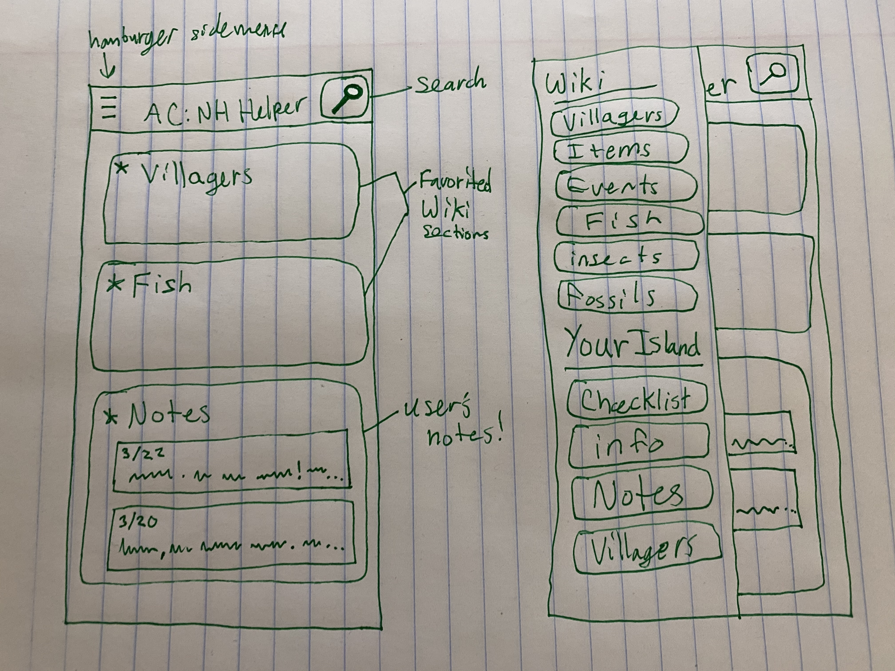

# Juniors Spring Intensive Deliverable Proposal
Dates 3/16-3/25

**Nicole Rocha** 

**Animal Crossing: New Horizons Helper app** 

**This project is new!**

**Solo Project**

## Description
I haven't started working on this yet and the game isn't being released until this Friday (March 20th). [But I know which API I can use to get info for my app](https://nookipedia.com/wiki/Nookipedia:Development). The goal is to make a mobile application for the game's wiki to make it easy to look up information from your phone while playing.

## Challenges I Anticipate
I'll have to learn how to use Swift, since I've never used it before. If that becomes too much of an issue, I'm planning on using Android Studio with Java because I already know how to make Android apps.

## Skateboard
First I'd like to get the API working on my backend.

## Bike
Then I'll make the layouts I need for the wiki section of my app.

## Car
These are the extra features I want to add down the line to make this a more polished app:
- [ ] Search bar for the entire wiki.
- [ ] The ability to add notes for each day like a journal.
- [ ] Set reminders for specific days and events.
- [ ] Favorite Wiki articles so they appear on the home page.
- [ ] Input information about your island: Which villagers you have, your town fruit, your town name, your character's name, etc.
- [ ] A checklist for the museum! So the user can check off which critters they have donated already and quickly check what time/location they can catch those critters.

## Personal Achievement Goals:
1. Get familiar with Swift!
2. Make an iOS app that's useful.
3. Make different data appear on different people's apple accounts. (like their island name and favorite wiki articles)

## Wireframes

## Evaluation

**You must meet the following criteria in order to pass the intensive:**

- Students must get proposal approved before starting the project to pass
- SOLO 
    - must score an average above a 2.5 on the [rubric](https://docs.google.com/document/d/1IOQDmohLBEBT-hyr-2vgw1mbZUNsq3fHxVfH0oRmVt0/edit)
- Pitch your product

## Approval Checklist
- [x] I have completed all the necessary parts of this proposal
- [x] I linked my proposal in the Spring Intensive Tracker

### Sign off
**Student Name:**                
> Name / Date
**Make School Advisor Name**
> TBD
